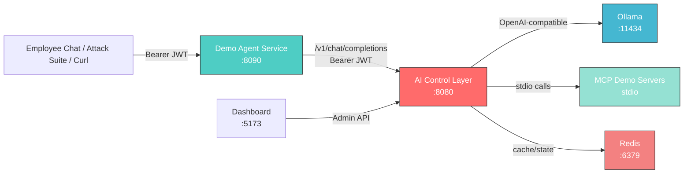
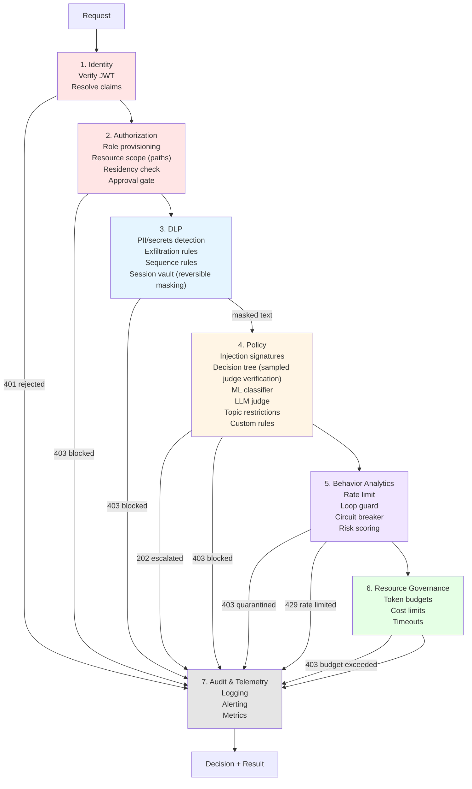
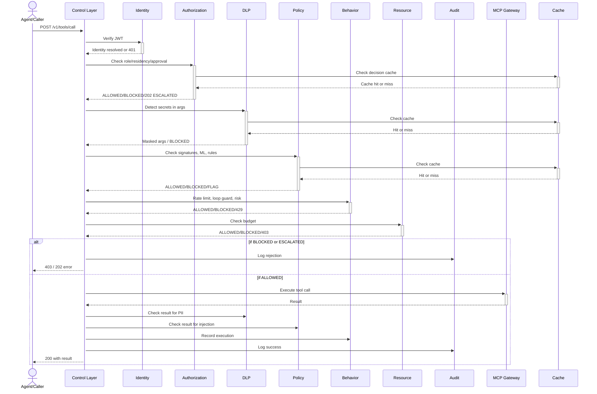
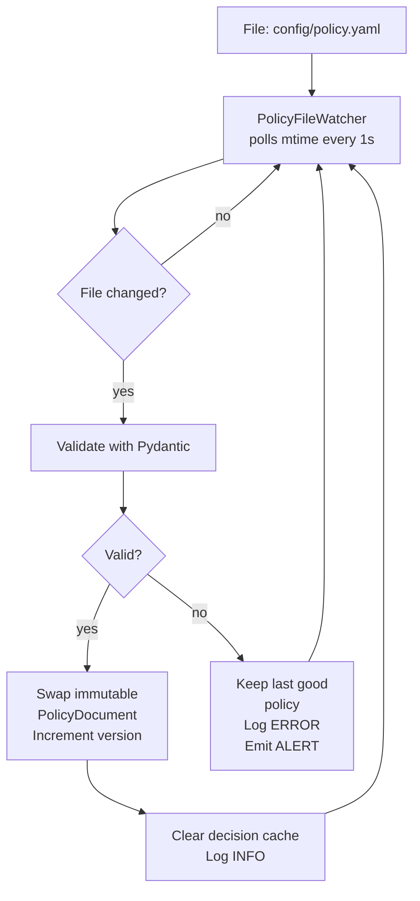
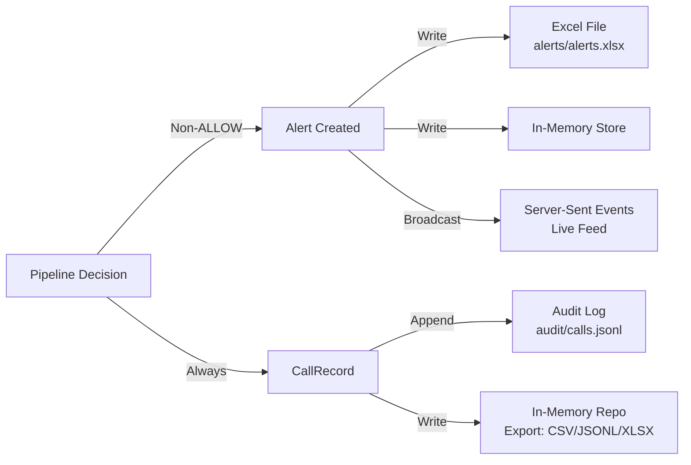

# AI Control Layer Architecture

## Overview

The AI Control Layer is a policy-enforcing proxy gateway that sits between AI agents and upstream services (language models, MCP tool servers). It implements centralized governance through a seven-stage deterministic and AI-driven processing pipeline, with hot-reloadable policy, real-time audit and alerting, budget enforcement, and OWASP-grounded controls.

## Component Diagram



## Seven-Stage Processing Pipeline

Every intercepted call (prompt → model, model response, tool call → MCP, tool result) passes through this **fixed, ordered pipeline** with timing and short-circuit capability:



## Tool Call Sequence Diagram

Shows how a tool call flows through the pipeline with all interception points:



## Ports and Adapters Architecture

The codebase follows **Clean Architecture** with strict dependency flow:

```
presentation/
  ├─ routers (FastAPI, SSE)
  ├─ schemas (Pydantic v2)
  └─ composition_root (DI container, stage registry)
       │
application/
  ├─ pipeline/ (ProcessingPipeline, stages)
  ├─ rules/ (RuleRegistry, evaluators)
  ├─ use_cases/ (ChatCompletion, ToolCall, Approvals, etc.)
  ├─ evaluators/ (RBAC, DLP, Signatures, ML, etc.)
  ├─ detectors/ (pure functions for PII, secrets)
  └─ services (budgets, sessions, risk)
       │
domain/
  ├─ models (Identity, Rule, PolicyDocument, etc.)
  ├─ ports (abstract interfaces)
  └─ exceptions
       │
infrastructure/
  ├─ adapters (concrete implementations)
  ├─ providers (Ollama, Mock, OpenAI-compatible)
  ├─ repositories (Redis, In-memory, YAML, Excel)
  └─ ml/ (Sklearn classifier, feature extraction)
```

**Dependency rule:** Domain imports nothing. Application imports domain only. Infrastructure implements domain ports. Composition root is the sole place adapters meet use cases.

## Interception Points and Caching Strategy

Four points where the pipeline intercepts traffic:

| Point | Trigger | Cache Key | Cacheable Stages |
|-------|---------|-----------|------------------|
| `prompt` | Before model call | `sha256(role\|point\|text_hash)\|policy_v` | DLP, Policy |
| `response` | After model returns | `sha256(role\|point\|text_hash)\|policy_v` | DLP, Policy |
| `tool_call` | Before MCP tool execution | `sha256(role\|point\|tool_args_hash)\|policy_v` | DLP, Policy |
| `tool_result` | After MCP tool returns | `sha256(role\|point\|result_hash)\|policy_v` | DLP, Policy |

**Cache invalidation:** Policy version change (bump on file reload) automatically invalidates all cache entries. Stages 1, 2, 5, 6, 7 always run (uncacheable).

## Hot-Reload Mechanism



## Alerting & Audit Architecture



**Excel:** Locked at process level, single writer. JSONL is the durable audit log.

## Performance Telemetry

Every call records per-stage timings and per-user metrics:

- **Stage latencies:** p50/p95 per stage (ms)
- **Proxy overhead:** p50/p95 for full pipeline (ms)
- **Upstream latency:** p50/p95 for model/MCP calls (ms)
- **Cache hit ratio:** percentage of cache hits in DLP + Policy
- **Calls per minute:** throughput gauge

## Scalability Notes and Limitations

**Single Process:**
- No multi-processing (Excel not thread-safe; Redis handles concurrency at connection level)
- Uvicorn workers=1; uvicorn-workers or gunicorn for horizontal scaling would require external coordinator for session/approval state

**In-Memory Fallback:**
- Redis unavailable → all state (budgets, sessions, risk, decision cache) reverts to memory
- No persistence; state resets on restart

**ML/Judge:**
- Inference via `asyncio.to_thread` (non-blocking)
- Model inference ~50–200ms on RTX 4070 with Qwen 7B

**MCP Servers:**
- Stdio processes spawned per startup in `lifespan` context
- Concurrent stdio calls serialized per RFC 5246 (safe)
- Tiny demo servers; production MCP would use HTTP adapters for parallelism

**Session Continuity:**
- `session_id` passed by agent; defaults to `Identity.sub` if omitted
- Taint propagation (sequence rules) is per-session; long-lived sessions accumulate state

## Directory Structure

```
Backend/
  pyproject.toml                      (packaging, dependencies)
  config/
    ├─ policy.yaml                   (hot-reloaded, v3 sample)
    ├─ mcp_servers.yaml              (9 demo servers)
    ├─ attack_signatures.yaml         (local feed)
    └─ users.yaml                    (demo SSO users)
  alerts/                             (generated, Excel file)
  audit/                              (generated, JSONL log)
  src/control_layer/
    ├─ domain/                       (models, ports, exceptions)
    ├─ application/
    │  ├─ pipeline/
    │  │  └─ stages/                 (7 stage implementations)
    │  ├─ evaluators/                (rule evaluators)
    │  ├─ detectors/                 (PII, secrets, patterns)
    │  ├─ rules/                     (registry, type inference)
    │  ├─ budgets/
    │  ├─ sessions/
    │  ├─ approvals/
    │  ├─ behavior/
    │  └─ use_cases/                 (chat, tools, admin endpoints)
    ├─ infrastructure/
    │  ├─ providers/                 (Ollama, Mock, OpenAI-compatible)
    │  ├─ repositories/              (Redis, In-memory, YAML, Excel)
    │  ├─ ml/                        (classifier, features)
    │  ├─ mcp_gateway/
    │  ├─ signature_feed/
    │  └─ adapters/
    ├─ presentation/
    │  ├─ main.py                   (FastAPI app, lifespan)
    │  ├─ routers/                  (v1/*, api/*)
    │  ├─ schemas/                  (Pydantic models)
    │  ├─ composition_root.py        (DI container)
    │  └─ errors.py                 (handlers)
    └─ ml/
       ├─ train.py                   (CLI entry for training)
       ├─ features.py                (TF-IDF)
       ├─ classifier.py              (wrapper)
       ├─ dataset/
       │  └─ prompt_injection_dataset.csv
       └─ artifacts/
          └─ prompt_injection_classifier.joblib
  src/demo_agent/
    ├─ main.py                       (FastAPI app)
    ├─ agent_loop.py                 (OpenAI tool-calling loop)
    └─ control_layer_client.py       (HTTP client)
  tests/
    ├─ unit/
    │  ├─ domain/
    │  ├─ application/
    │  ├─ infrastructure/
    │  └─ ml/
    ├─ integration/
    └─ conftest.py

Frontent/
  src/
    ├─ pages/                        (React routes)
    ├─ components/                   (UI components)
    ├─ hooks/                        (TanStack Query, SSE)
    ├─ api/                          (API client)
    ├─ types/                        (TypeScript types)
    └─ test/

demo/mcp/
  ├─ github.py
  ├─ ci.py
  ├─ logs_db.py
  ├─ jira.py
  ├─ hr_db.py
  ├─ calendar.py
  ├─ mail.py
  ├─ payments.py
  ├─ eu_customers.py
  └─ data.py

WIKI/
  ├─ api-contract.md
  ├─ architecture.md               (this file)
  ├─ policy-reference.md
  ├─ owasp-mapping.md
  ├─ judges-quickstart.md
  ├─ demo-script.md
  ├─ README.MD
  └─ reference/
     ├─ task.req
     └─ ui-mockups.html

presentation/
  ├─ slides.html
  ├─ README.md
  └─ slides.pdf                    (generated)

Root:
  ├─ README.md
  ├─ docker-compose.yml
  ├─ .env.example
  ├─ .dockerignore
  ├─ attack_suite.py
  └─ scripts/
     ├─ bootstrap.{ps1,sh}
     ├─ test.{ps1,sh}
     ├─ lint.{ps1,sh}
     ├─ train_ml.{ps1,sh}
     ├─ run_dev.{ps1,sh}
     └─ export_slides.{ps1,sh}
```

---

**See also:** [API Contract](api-contract.md), [Policy Reference](policy-reference.md), [OWASP Mapping](owasp-mapping.md), [Demo Script](demo-script.md)
